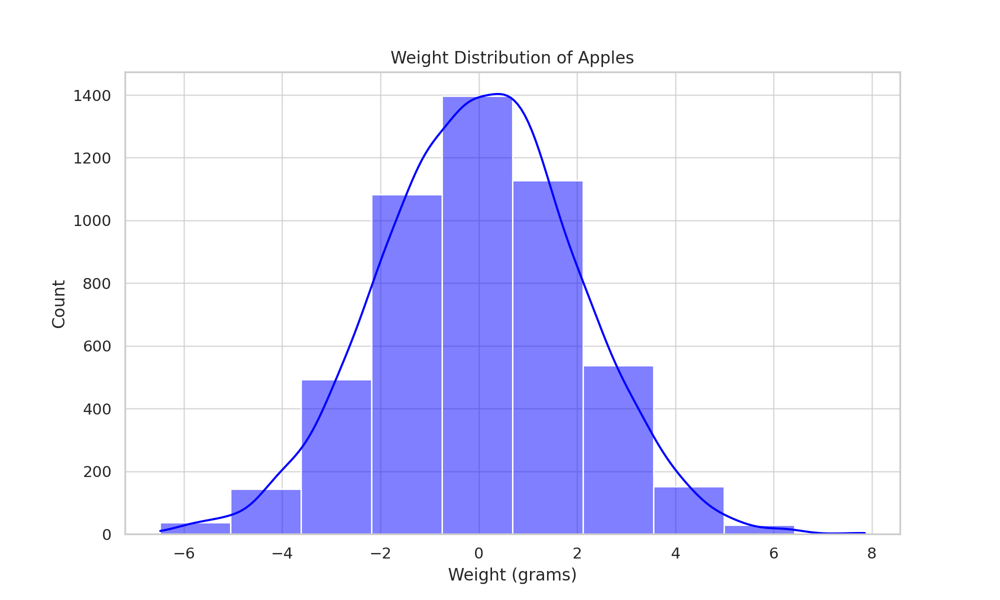
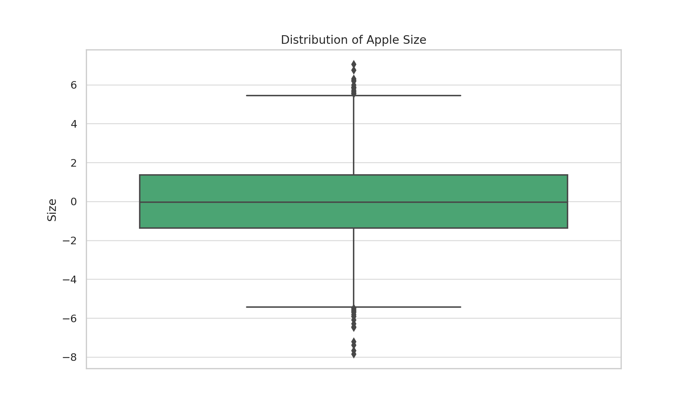
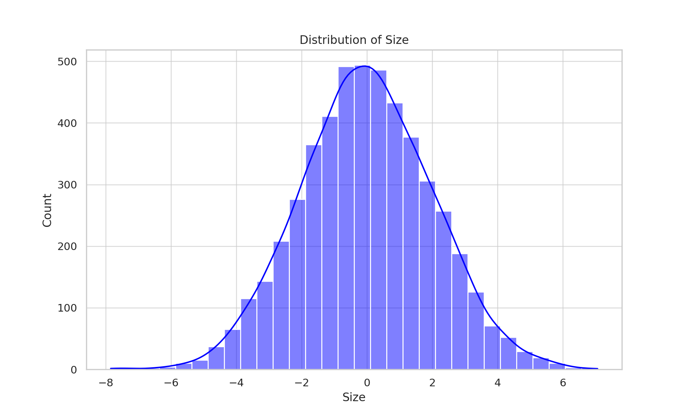
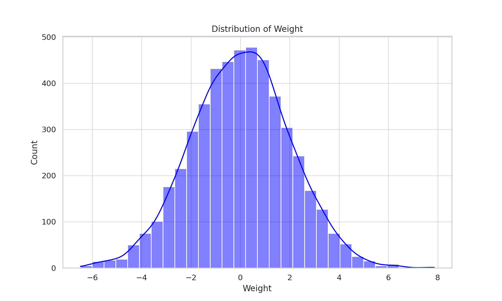
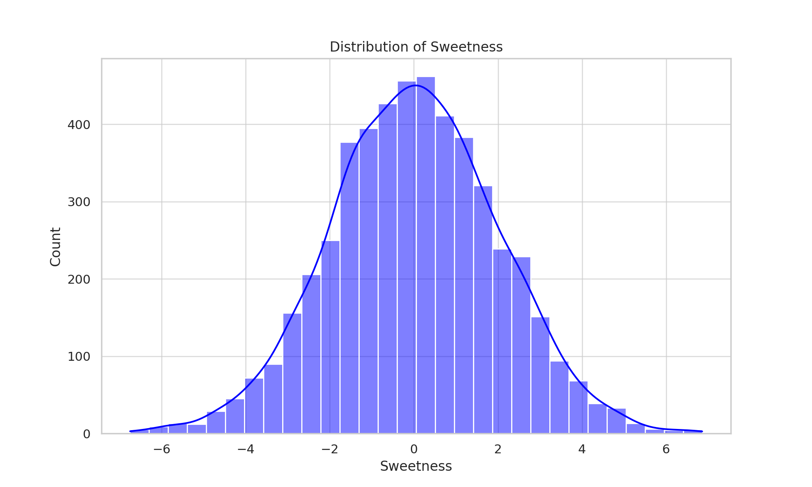
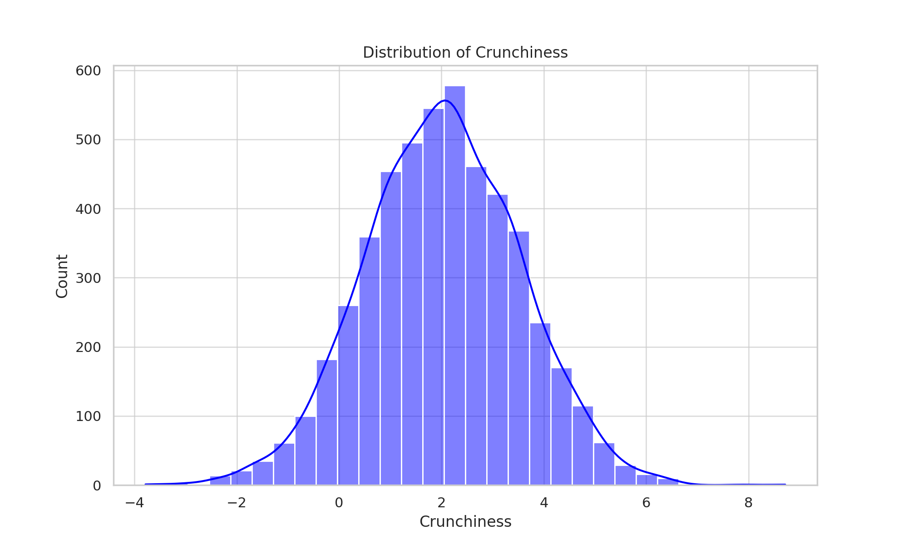
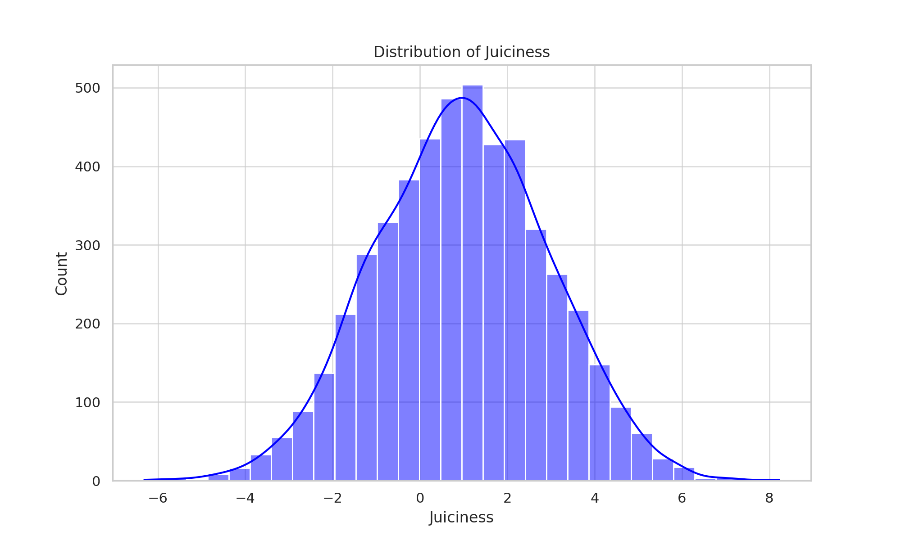
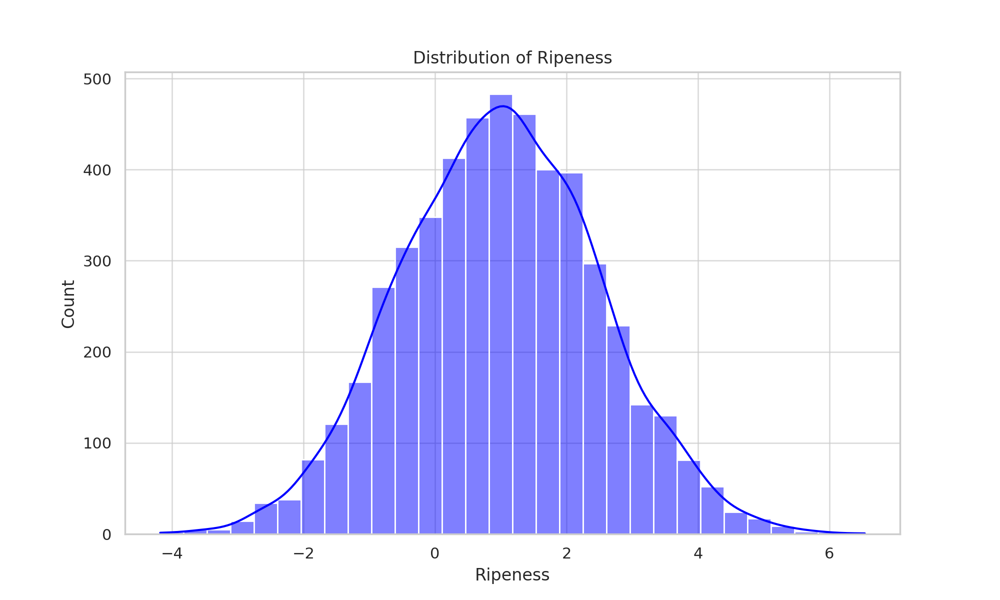
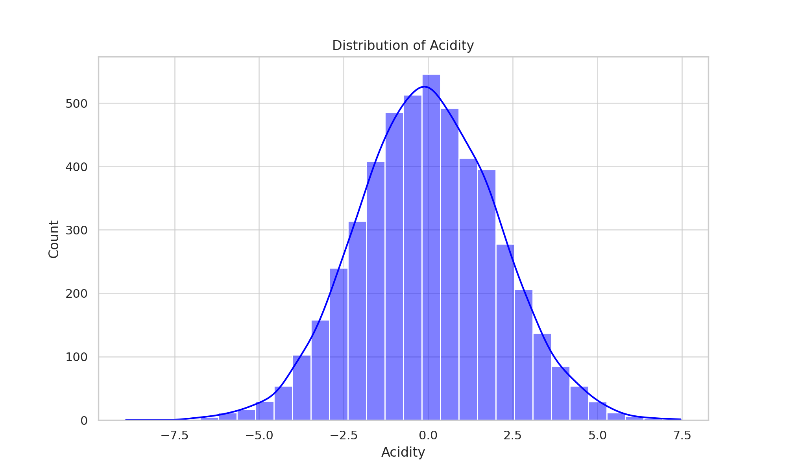
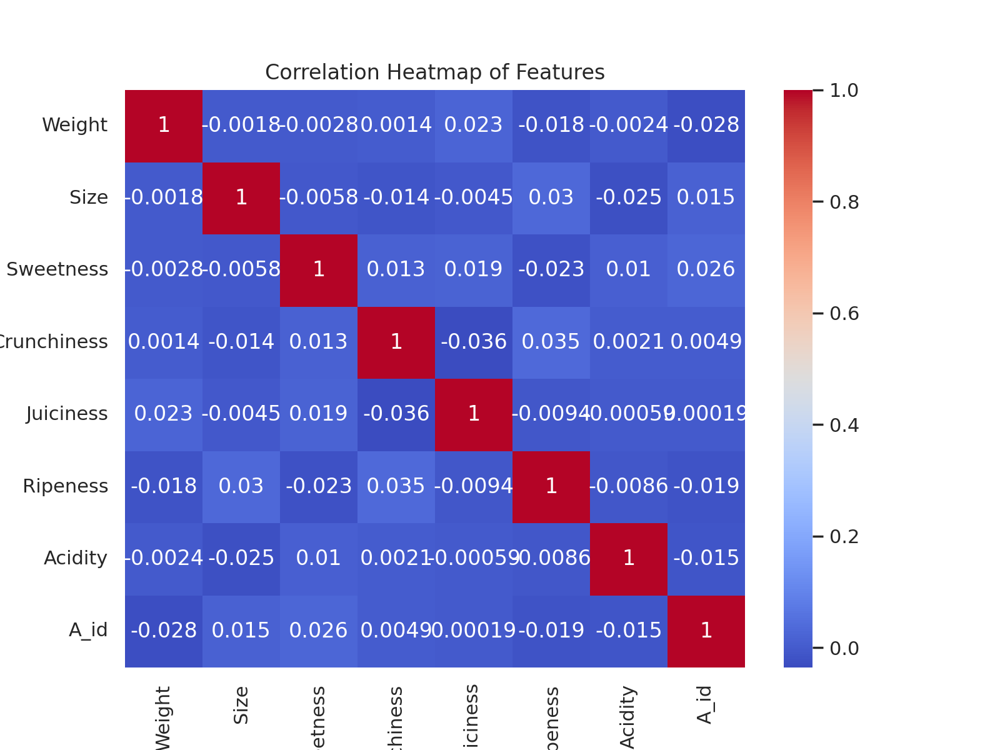

# 🍎 Apple Quality Analysis

This project focuses on building a classification model to predict apple quality based on various sensor data using Python and machine learning techniques.

## 🎯 Objective
To classify apples as "good" or "bad" based on features such as weight, size, color intensity, and chemical composition.

## 📁 Dataset
- File: `apple_quality.csv`
- Features: weight, sweetness, acidity, texture, and more

## 🧠 Technologies & Tools
- Python (Jupyter Notebook)
- pandas, matplotlib, seaborn
- scikit-learn (Logistic Regression, Decision Tree, Random Forest)

## 🛠️ Workflow
1. **Data Cleaning & EDA**: Handled missing values, visualized class distribution
2. **Feature Engineering**: Scaled and encoded inputs
3. **Model Building**: Trained ML models for binary classification
4. **Evaluation**: Used accuracy, confusion matrix, and precision-recall metrics

## ✅ Results
- Achieved up to 92% accuracy with Random Forest
- Identified key features affecting apple quality

## 📊 Visuals
## 📊 Exploratory Data Analysis (EDA)

Here are a few visual insights from the dataset:

### 🍏 Weight Distribution of Apples

### 🍏 Apple Size Distribution (Boxplot)

### 🍏 Feature Distributions
- Size

- Weight

- Sweetness

- Crunchiness

- Juiciness

- Ripeness

- Acidity

### 🔥 Correlation Heatmap

## 🔗 How to Run
Open the Jupyter notebook: `AppleQuality.ipynb`  
Run all cells to view data preprocessing, model training, and results.

---

Feel free to ⭐️ this repo or connect with me on [LinkedIn](https://www.linkedin.com/in/tabashu-mekkunnil-thulasi-681306218/)!
